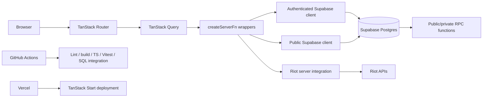
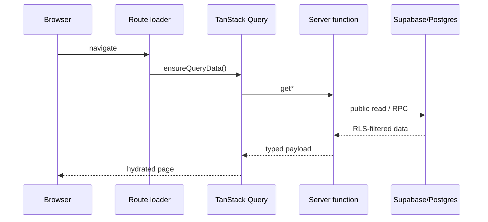
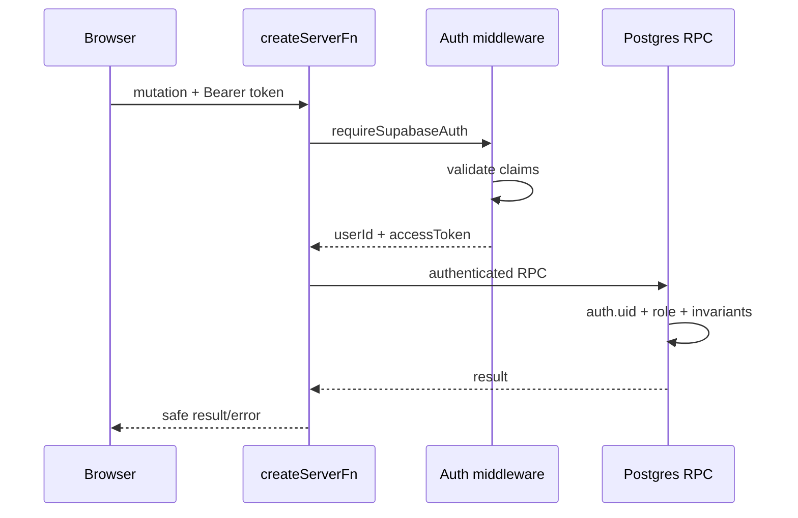

# EloShape architecture

Last reviewed: 2026-09-22.

## 1. System overview

EloShape is a React/TanStack Start application backed by Supabase. Public pages use server-side public reads; authenticated actions use the caller's Supabase access token so Postgres/RLS remains the authorization boundary.

## 2. Core stack

- React 19
- TanStack Start
- TanStack Router
- TanStack Query
- TypeScript
- Vite 8
- Tailwind CSS 4
- shadcn/Radix UI primitives
- Supabase Postgres + Auth + Edge Functions
- Vercel
- GitHub Actions
- Bun

## 3. Client/server boundary

### Public reads

Files such as `src/lib/eloshape.functions.ts` and `src/lib/splits.functions.ts` expose small `createServerFn` wrappers. They dynamically import server-only modules and use the publishable Supabase key through `createPublicClient()`.

Public reads are intentionally constrained by RLS and public SELECT policies.

### Authenticated actions

`src/integrations/supabase/auth-middleware.ts`:

1. reads the Bearer token from the request;
2. validates token shape;
3. validates claims with Supabase;
4. places only `userId` and `accessToken` in middleware context;
5. server functions rebuild an authenticated Supabase client.

No Supabase client instance is serialized through TanStack context.

### Staff actions

Staff server functions additionally validate `user_roles`. Database-side staff RPCs validate staff/admin authority again. The application intentionally uses defense in depth.

## 4. Data-flow patterns

### Public page

### Authenticated mutation

## 5. Routing map

### Public routes

| Route | Purpose |
| --- | --- |
| `/` | Landing page |
| `/auth` | Sign in / registration |
| `/auth/reset-password` | Password reset |
| `/tournaments` | Tournament directory |
| `/tournaments/$slug` | Tournament overview, participants, standings and bracket |
| `/splits` | Semi-Split directory |
| `/splits/$slug` | Qualifiers, seeding table, qualified field and playoff bracket |
| `/rankings` | Player rankings |
| `/players/$handle` | Public player profile |
| `/teams` | Team directory + Scrim Finder |
| `/teams/$slug` | Public team profile |
| `/divisions` | Division explanation |
| `/rules` | Competition rules |
| `/privacy` | Privacy policy |
| `/terms` | Terms |
| `/maintenance` | Production maintenance surface |

### Authenticated routes

| Route | Purpose |
| --- | --- |
| `/dashboard` | Player dashboard/onboarding |
| `/team` | Team HQ / roster |
| `/team/players` | Recruiting/free-agent search |
| `/team/settings` | Team identity/settings/archive |
| `/matches/$matchId` | Match result workflow |
| `/support` | User support requests |
| `/admin` | Staff control center |
| `/admin/splits` | Semi-Split operations |
| `/admin/disputes` | Match disputes |
| `/admin/support` | Support queue |

`src/routes/_authenticated/route.tsx` is the route gate for authenticated pages.

## 6. Major application modules

- `eloshape.*`: public directory/tournament/team/player reads.
- `competition.*`: staff tournament engine.
- `splits.*`: public Semi-Split reads.
- `split-ops.functions.ts`: staff Semi-Split RPC wrapper.
- `team.functions.ts`: team creation, invites, leave/remove flows.
- `team-management.functions.ts`: captain transfer, roles and lane assignment.
- `scrim.functions.ts`: practice match lifecycle.
- `tournament.functions.ts` + `tournament-entry.server.ts`: registration/check-in.
- `match-result.functions.ts`: participant result confirmation/disputes.
- `riot*.ts`: Riot lookup/sync integration.
- `support.functions.ts`: user/staff support workflow.
- `admin.*`: eligibility/admin read models.

## 7. UI architecture

Reusable product components live in `src/components/eloshape/`. Generic primitives live in `src/components/ui/`.

Product surfaces should use semantic CSS tokens rather than raw colors. The visual language is dark graphite, restrained orange/gold accents, subtle gradients, low-opacity borders and compact competitive data density.

## 8. Deployment topology

- `staging`: development, QA and review environment.
- `main`: production branch.
- Production remains intentionally behind maintenance until launch conditions are met.
- Database DDL is represented by ordered files in `supabase/migrations/`.
- Vercel deploys Git commits.
- GitHub Actions validates both application and database behavior.
