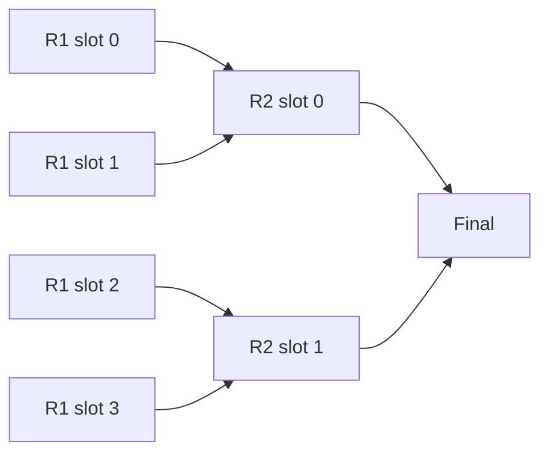
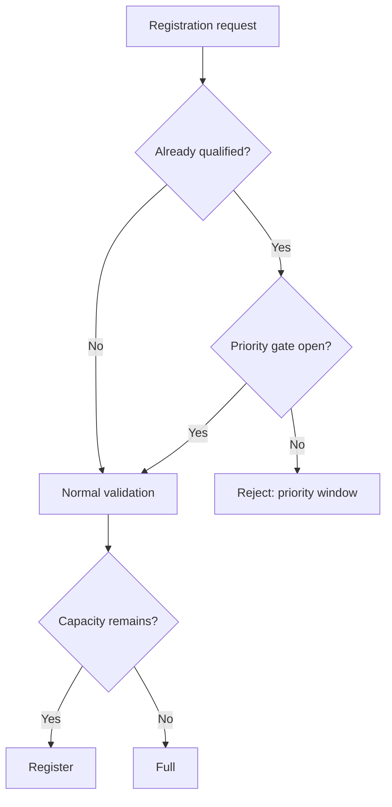

# Brackets and qualifier semantics

Last reviewed: 2026-09-22.

This document is the focused reference for the two areas that are easiest to confuse during QA: bracket geometry and qualifier final standings.

## 1. Bracket data model

A bracket is not stored as nested JSON. Every official match is a row in `matches`.

The coordinates are:
- `round_index`: zero-based round;
- `bracket_slot`: zero-based slot within the round.

Competitors are `tournament_entries`, referenced by:
- `entry_a_id`;
- `entry_b_id`;
- `winner_entry_id`.

The unique database coordinate is `(tournament_id, round_index, bracket_slot)`.

## 2. Advancement rule

For normal single elimination:

```text
next_round = round_index + 1
next_slot  = floor(bracket_slot / 2)
```

Two opening matches therefore feed one next-round match.



## 3. Why opening-round cards used to overlap

Bracket connectors and cards use absolute coordinates. If the renderer assumes a 118 px card but the actual card grows to 140+ px because of metadata, two adjacent Round-of-16 cards can visually overlap even though their centers are different.

The current renderer avoids that failure mode by keeping these values explicit:
- fixed match-card height;
- fixed vertical gap;
- `MATCH_PITCH = card height + gap`;
- board height based on the largest round.

The wrapper and the card both receive the fixed height. Text is truncated rather than allowed to silently change geometry.

## 4. Required bracket QA matrix

Every bracket UI change must be inspected against:

| Case | Expected |
| --- | --- |
| 16 teams, not played | 8 opening cards with visible gap |
| 16 teams, completed | same geometry, winner emphasis only |
| long names/tags | truncation, no height growth |
| bye | card remains same height |
| walkover | card remains same height |
| final | centered, gold championship treatment |
| desktop | connectors align to card centers |
| mobile | horizontal scrolling, no squeezed columns |

The automated SQL tests validate tournament logic; they do not replace this visual matrix.

## 5. Final standings are tournament-local

`loadTournamentDetail(slug)`:
1. loads exactly one tournament by slug;
2. filters `tournament_entries` by that tournament's ID;
3. filters `matches` by that tournament's ID.

Therefore two qualifiers can show the same final order without sharing the same tournament rows.

## 6. Why qualifiers can have repeated winners

The product permits an already-qualified team to enter a later qualifier **after** the protected priority window opens and if capacity remains.

If that team finishes high again:
- its tournament placement is real and remains visible;
- it does not receive a duplicate Semi-Split qualification;
- the available qualification slot passes down.

This creates a valid case where Qualifier #1 and Qualifier #2 may both show Team A near the top, while Qualifier #2 awards its new playoff slot to a lower finisher.

## 7. Protected registration window

`qualified_teams_registration_opens_at` exists to protect limited qualifier capacity.



## 8. Final standings versus qualification outcome

Tournament page semantics:

- **Final standings**: every team's actual finish and tournament points.
- **Qualification outcome**: only the teams that obtained a new `split_qualifications` row from this event.
- **Already qualified**: participant whose active qualification came from an earlier qualifier.
- **Pass-down**: a new qualifier whose tournament finish is below the direct slot range because one or more higher finishers were already qualified.

The UI must never rewrite final standings simply to make qualifiers look different.

## 9. Staging demo fixtures

The Rosario Gold staging fixtures intentionally contain deterministic outcomes and reused rosters. They are useful for stable regression checks but can look artificial.

The UI therefore labels demo fixtures and surfaces the actual qualification outcome separately.

If the demo data is ever replaced, the replacement must preserve:
- each tournament's own entries/matches;
- ledger consistency;
- 16 unique active split qualifications;
- playoff seed consistency;
- point totals;
- competition tests.

## 10. Relevant files

- `src/components/eloshape/BracketView.tsx`
- `src/lib/bracket.ts`
- `src/lib/eloshape.server.ts`
- `src/routes/tournaments.$slug.tsx`
- `src/lib/competition.server.ts`
- `src/lib/splits.server.ts`
- `supabase/tests/competition_engine.test.sql`
- `supabase/tests/prelaunch_16_team_semisplit.test.sql`
- `supabase/tests/scrims_and_priority.test.sql`
