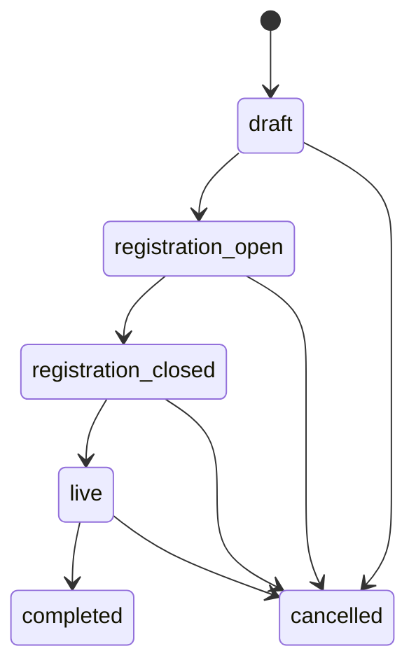
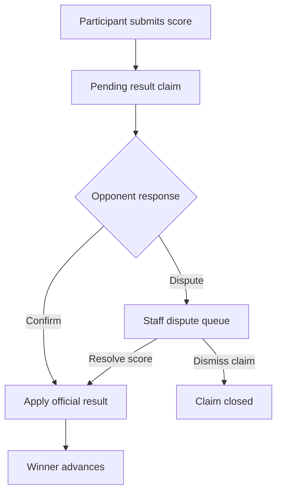
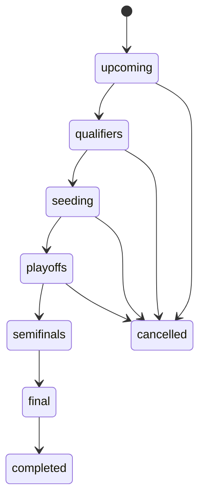

# EloShape competition engine

Last reviewed: 2026-09-22.

## 1. Tournament lifecycle

Operational milestones are separate from status and include entry lock, bracket generation and finalization timestamps.

## 2. Registration and check-in

For a team tournament, registration validates server-side:

- tournament state and capacity;
- correct division;
- geographic eligibility;
- team roster;
- each starter's eligibility state;
- Riot data/rank/platform;
- minimum Riot account level;
- roster size;
- legal requirements where applicable.

If check-in is required, registration alone is not enough to enter the bracket.

## 3. Entry lock and roster snapshot

`private.lock_tournament_entries`:

1. locks the tournament operation;
2. determines which entries are valid;
3. snapshots eligible team members into `tournament_roster_members`;
4. excludes invalid/unconfirmed entries;
5. makes later team-roster changes irrelevant to the locked tournament.

## 4. Bracket generation

`src/lib/bracket.ts` and server competition logic generate single-elimination topology.

A 16-team field creates:
- Round of 16: 8 matches;
- Quarterfinals: 4;
- Semifinals: 2;
- Final: 1;
- total: 15 matches.

The database stores zero-based `round_index` and `bracket_slot`.

## 5. Public bracket rendering

`src/components/eloshape/BracketView.tsx` renders the database coordinates as a left-to-right tournament tree.

The layout uses a fixed match-card height and an explicit vertical pitch. This is intentional: bracket geometry must not depend on text/content height, otherwise opening-round cards can overlap.

For a round with N matches:
- the board reserves N vertical slots;
- each match center is distributed evenly in that space;
- the next-round center becomes the midpoint of the two feeder matches;
- SVG connectors link feeder centers to the next round.

Do not reintroduce dynamic match-card height without changing the geometry engine.

## 6. Result flow

### Staff path

Staff can report a result directly through audited competition RPCs.

### Participant path

Result mutation is row-locked and validated against the best-of format.

## 7. Safe completed-result correction

Staff may correct a completed match only while doing so cannot invalidate already-started downstream competition. Corrections are audited and require a reason.

The integration tests exercise:
- correction before downstream activity;
- rejection after downstream activity;
- double submission/idempotency protections.

## 8. Bye and walkover semantics

| Resolution | Advances | Match-win points |
| --- | ---: | ---: |
| Played win | Yes | Yes |
| Walkover | Yes | Yes |
| Automatic bye | Yes | No |

Scoring must use `resolution_type`, not only `is_bye`.

## 9. Finalization and scoring

Finalization:

1. verifies that the final has a winner;
2. verifies no playable match remains unresolved;
3. derives wins and placement;
4. awards participation/win/phase points from `point_rules`;
5. updates entry placement and awarded points;
6. recomputes cached team/player totals;
7. assigns qualifier slots when applicable;
8. marks the tournament completed;
9. writes an audit event.

Awards use idempotent event keys so finalization cannot duplicate points.

## 10. Semi-Split lifecycle

A standard Semi-Split has four qualifiers and a 16-team playoff field.

## 11. Qualification and pass-down

Each qualifier grants configured slots. If a finishing team is already qualified, the slot passes down to the next eligible, non-qualified team.

Qualification records live in `split_qualifications`; the engine prevents duplicate active qualification for one team.

## 12. Qualifier registration priority

A qualified team may be blocked from a later qualifier until `qualified_teams_registration_opens_at`.

Purpose:
- give non-qualified teams first access to limited qualifier capacity;
- still allow already-qualified teams to practice/compete later if capacity remains.

The registration RPC returns the gate state so the UI can explain why a team cannot register yet.

## 13. Final standings versus qualification outcome

For a qualifier, these are separate views of the same event:

- **Final standings** are tournament-local placement results.
- **Qualification outcome** is the subset of teams that gained a new active `split_qualifications` slot from that qualifier.
- A team already qualified from an earlier qualifier can still finish first later after the protected registration gate opens.
- In that case the new qualification slot passes down to the next eligible finisher.

The public tournament detail exposes this distinction directly so repeated high finishers are not mistaken for duplicated tournament data.

## 14. Semi-Split standings

`split_standings(split_id)` is a **qualifier-only seeding table**.

It aggregates:
- qualifier team points;
- qualifier match wins/losses;
- number of qualifiers entered;
- qualification status/source.

Playoff results award legitimate circuit points but do not reorder the seeding table that determined the playoff field.

## 15. Staging demo qualifier caveat

The current staging demo includes completed Rosario Gold qualifiers populated with deterministic fixture outcomes. Several qualifiers reuse demo rosters and the fixture historically resolves the same high seeds through the bracket. Therefore their public final standings can look identical.

That is fixture data, not a cross-tournament query bug. Public tournament detail reads are filtered by the tournament's own `id` for both entries and matches.

Production behavior is driven by each qualifier's actual registrations and results.

## 16. Regression coverage

SQL tests:

- `competition_engine.test.sql`
- `prelaunch_16_team_semisplit.test.sql`
- `scrims_and_priority.test.sql`
- `security_boundaries.test.sql`

The 16-team stress test creates four qualifiers, verifies pass-down, produces a 16-team playoff, completes it, validates point behavior and rolls everything back.
