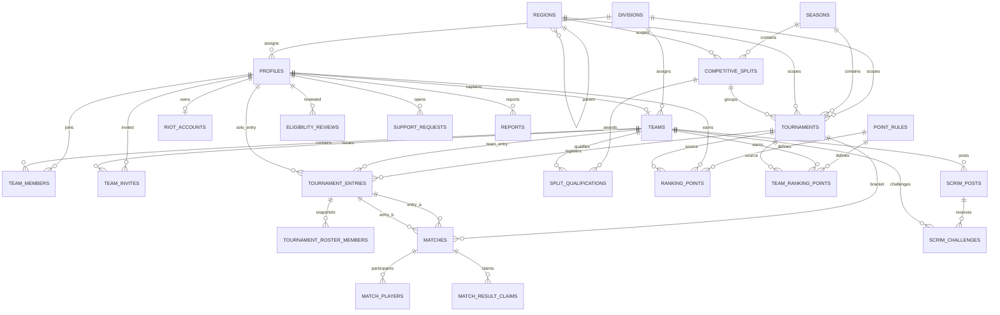

# EloShape database

Last reviewed against the staging schema: 2026-09-22.

The public schema currently contains 28 base tables. Competitive write paths are intentionally concentrated in RPC/server logic instead of direct browser writes.

## 1. Entity relationship overview

## 2. Table catalog

| Table | Responsibility |
| --- | --- |
| `regions` | Hierarchical region/country/province/city model. Self-references with `parent_id`. |
| `divisions` | Competitive divisions and Riot tier mapping. |
| `seasons` | Competitive seasons. |
| `point_rules` | Configurable scoring rules. |
| `profiles` | Public EloShape player profile and cached competitive totals. |
| `user_roles` | `admin`, `moderator`, `player` authorization roles. |
| `riot_accounts` | Private Riot account linkage/sync state. PUUID remains server-only. |
| `teams` | Team identity, captain, location, division and cached totals. |
| `team_members` | Current roster membership, starter/substitute state and lane role. |
| `team_invites` | Team invitation lifecycle. |
| `tournaments` | Tournament configuration and lifecycle milestones. |
| `tournament_entries` | Team/solo registration, seed, placement and awarded points. |
| `tournament_roster_members` | Immutable roster snapshot used for locked competition. |
| `matches` | Bracket coordinates, participants, result and resolution type. |
| `match_players` | Per-match player association/stat model. |
| `match_result_claims` | Player/captain result reports, confirmations and disputes. |
| `competitive_splits` | Semi-Split lifecycle and playoff configuration. |
| `split_qualifications` | Teams qualified from qualifiers into a split playoff field. |
| `ranking_points` | Player point ledger. |
| `team_ranking_points` | Team point ledger. |
| `competition_audit_log` | Staff competition-operation audit trail. |
| `eligibility_reviews` | Manual eligibility review history. |
| `achievements` | Player achievements. |
| `reports` | User reports/moderation records. |
| `support_requests` | Support/privacy/account-deletion requests. |
| `legal_acceptances` | Versioned legal acceptance records. |
| `scrim_posts` | Practice availability, opponent and result. |
| `scrim_challenges` | Challenges sent to open scrim posts. |

## 3. Enums

- `app_role`: admin, moderator, player
- `eligibility_status`: eligible, pending_review, rejected, suspended
- `entry_status`: registered, checked_in, withdrawn, disqualified
- `match_status`: scheduled, live, completed, cancelled
- `qualification_status`: qualified, withdrawn, replaced
- `region_kind`: region, country, province, city
- `report_status`: open, reviewing, resolved, dismissed
- `split_status`: upcoming, qualifiers, seeding, playoffs, semifinals, final, completed, cancelled
- `tournament_status`: draft, registration_open, registration_closed, live, completed, cancelled

## 4. Competitive invariants

### Ledger, not editable totals

`ranking_points` and `team_ranking_points` are the source of truth for awards. Profile/team totals are recomputed from trusted server logic.

### Immutable competition roster

When entries are locked, the active roster is copied into `tournament_roster_members`. That snapshot is protected against mutation and is the competition roster even if the normal team roster later changes.

### Match coordinates

Single-elimination matches use zero-based coordinates:

- `round_index = 0`: opening round.
- `bracket_slot = 0..n`: match within the round.
- winner advances to:
  - `round_index + 1`
  - `floor(bracket_slot / 2)`

### Bye vs walkover

- Bye: automatic advancement and no match-win points.
- Walkover: administrative competitive win; it advances and counts as a match win.
- `resolution_type` is authoritative for scoring this distinction.

## 5. Semi-Split data model

`competitive_splits` groups qualifier tournaments and one playoff tournament.

`split_qualifications` records:
- team;
- source qualifier;
- qualification position;
- status;
- replacement relationship;
- playoff seed.

`split_standings(split_id)` intentionally includes **qualifier tournaments only**. Playoff point awards remain valid in the overall ledger but do not retroactively alter the qualifier seeding table.

## 6. Scrim data model

`scrim_posts`:
- host team;
- captain/profile that created the post;
- start/end window;
- Bo1/Bo3/Bo5;
- note;
- open/matched/cancelled/completed;
- opponent;
- score;
- winner.

`scrim_challenges`:
- scrim;
- challenger team;
- creator;
- pending/accepted/declined/cancelled.

Scrims never write to `team_ranking_points`, `ranking_points`, `split_qualifications` or official match tables.

## 7. Trigger inventory

- `competitive_splits_updated_at`
- `eligibility_updated_at`
- `normalize_match_resolution` on match INSERT/UPDATE
- `profiles_updated_at`
- `riot_accounts_updated_at`
- `scrim_challenges_updated_at`
- `scrim_posts_updated_at`
- `tournament_roster_members_immutable`
- `tournaments_updated_at`

## 8. Public RPC inventory

### Player/profile

- `ensure_my_profile()`
- `recalculate_my_profile_completion()`
- `update_my_location(city)`

### Team lifecycle

- `create_my_team(name, tag)`
- `update_my_team(name, tag, bio)`
- `archive_my_team()`
- `get_my_team_hub()`
- `invite_my_team_member(handle, role)`
- `cancel_my_team_invite(invite)`
- `respond_my_team_invite(invite, accept)`
- `remove_my_team_member(handle)`
- `leave_my_team()`
- `transfer_my_team_captain(handle)`
- `update_my_team_member_role(handle, role)`
- `update_my_team_member_lane_role(handle, lane_role)`
- `search_my_team_candidates(query, limit)`

### Tournament self-service

- `register_my_tournament(slug)`
- `register_my_team_tournament(slug)`
- `check_in_my_tournament(slug)`
- `check_in_my_team_tournament(slug)`
- `get_my_tournament_entry(slug)`

### Match-result workflow

- `get_my_match_result(match)`
- `submit_my_match_result(match, scores, evidence, note)`
- `respond_my_match_result(match, confirm, note)`

### Semi-Split

- `split_standings(split)`

### Scrims

- `list_scrims()`
- `get_my_scrim_hub()`
- `create_my_scrim(...)`
- `challenge_scrim(scrim)`
- `respond_scrim_challenge(challenge, accept)`
- `cancel_my_scrim(scrim)`
- `report_my_scrim_result(scrim, scores)`

### Support

- `submit_my_support_request(...)`
- `get_my_support_requests()`

### Staff

- `staff_create_bracket`
- `staff_lock_tournament_entries`
- `staff_report_match_result`
- `staff_record_match_walkover`
- `staff_correct_match_result`
- `staff_finalize_tournament`
- `staff_get_split_ops`
- `staff_generate_split_playoffs`
- `staff_replace_withdrawn_qualifier`
- `staff_set_split_status`
- `staff_set_player_eligibility`
- `staff_list_match_disputes`
- `staff_resolve_match_dispute`
- `staff_dismiss_match_dispute`
- `staff_list_support_requests`
- `staff_update_support_request`

## 9. Private engine functions

The `private` schema contains the trusted implementation layer. Important functions include:

- authorization: `actor_is_staff`, `has_role`, `is_staff`;
- competition: `lock_tournament_entries`, `create_bracket`, `report_match_result`, `apply_match_result_core`, `correct_completed_match_result`, `record_match_walkover`, `finalize_tournament`;
- bracket helpers: `seed_order`, `round_label`, `bracket_entry_ids`;
- Semi-Split: `assign_qualification_slots`, `replace_withdrawn_qualifier`, `generate_split_playoffs`, `set_split_status`;
- eligibility: `player_eligibility_reasons`, `team_eligibility`, `team_is_eligible`;
- accounting: `award_entry`, `recompute_profile_stats`, `recompute_team_stats`;
- roster: `snapshot_entry_roster`, `roster_snapshot_immutable`;
- auth/profile: `handle_new_auth_user`, `provision_profile`, `unique_player_handle`, `resolve_location`;
- audit/legal helpers.

These functions are not intended as general browser APIs.

## 10. RLS model

RLS is enabled on the application tables. Broadly:

- public competitive directory data is SELECT-readable;
- Riot linkage is owner/staff only;
- user roles are own/admin readable;
- reports/eligibility/support are restricted;
- sensitive writes occur through authenticated RPC/server paths;
- staff functions re-check authorization;
- SECURITY DEFINER functions are hardened with restricted search paths.

Never add a permissive write policy simply to make a browser mutation work. Add/extend an authenticated RPC and test the boundary instead.
