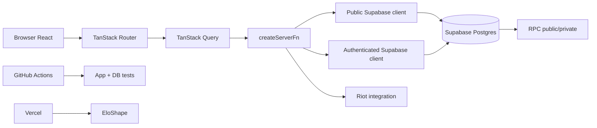
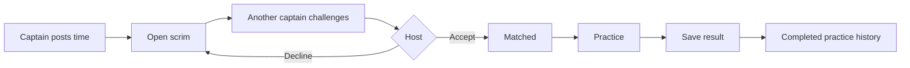

# EloShape — Documentación definitiva

Última revisión: **22/09/2026** · rama de referencia: **staging**.

Esta es la entrada principal a la documentación del producto y del código. La documentación detallada está separada por dominio para que sea mantenible y no quede un único archivo gigante desactualizado.

## 1. Qué es EloShape

EloShape es una plataforma competitiva amateur de League of Legends orientada inicialmente a LAS. Los jugadores crean perfiles, vinculan su Riot ID, forman equipos 5v5, compiten en torneos y Semi-Splits, reportan resultados y acumulan puntos EloShape.

Principios del sistema:

1. El rango de Solo Queue de Riot determina **elegibilidad/división**, no puntos EloShape.
2. Los puntos EloShape provienen de competencia oficial de EloShape.
3. Los scrims son práctica y tienen impacto competitivo oficial igual a cero.
4. El backend valida cupos, roster, elegibilidad, resultados, scoring y permisos.
5. Los registros competitivos relevantes tienen trazabilidad/auditoría.
6. `staging` es el entorno de desarrollo/QA; `main` representa producción.

## 2. Documentos fuente de verdad

| Documento | Qué contiene |
| --- | --- |
| [README de documentación](./README.md) | Índice y reglas de mantenimiento |
| [ARCHITECTURE.md](./ARCHITECTURE.md) | Arquitectura completa, flujo browser/server/DB y rutas |
| [DATABASE.md](./DATABASE.md) | Modelo de datos, ERD, seguridad e invariantes |
| [SCHEMA_REFERENCE.md](./SCHEMA_REFERENCE.md) | Referencia campo por campo de las 28 tablas, constraints, índices, policies y triggers |
| [RPC_REFERENCE.md](./RPC_REFERENCE.md) | Catálogo completo de funciones/RPC public y private |
| [MIGRATIONS.md](./MIGRATIONS.md) | Historial ordenado de migraciones y diferencias exclusivas de staging |
| [COMPETITION_ENGINE.md](./COMPETITION_ENGINE.md) | Torneos, bracket, scoring, qualifiers y Semi-Splits |
| [TEAMS_AND_SCRIMS.md](./TEAMS_AND_SCRIMS.md) | Equipos, roles, invitaciones y scrims |
| [OPERATIONS.md](./OPERATIONS.md) | Manual operativo de staff |
| [DEVELOPMENT.md](./DEVELOPMENT.md) | Desarrollo, migraciones, testing y CI |
| [CODE_MAP.md](./CODE_MAP.md) | Dónde vive cada parte del código |
| [FLOW_REFERENCE.md](./FLOW_REFERENCE.md) | Flujo completo pantalla → server function → RPC → tablas → tests |
| [BRACKETS_AND_QUALIFIERS.md](./BRACKETS_AND_QUALIFIERS.md) | Geometría del bracket, prevención de overlaps y semántica de qualifiers/pass-down |
| [KNOWN_ISSUES.md](./KNOWN_ISSUES.md) | Fixtures demo, dependencias externas y pendientes |
| [ENVIRONMENTS.md](./ENVIRONMENTS.md) | Staging/production |
| [TOURNAMENT_ZERO_RUNBOOK.md](./TOURNAMENT_ZERO_RUNBOOK.md) | Ensayo de torneo real |
| [RIOT-PRODUCTION-APPLICATION.md](./RIOT-PRODUCTION-APPLICATION.md) | Integración Riot / Production API |
| [AUTH_EMAIL_SETUP.md](./AUTH_EMAIL_SETUP.md) | Correo/Auth |
| [VIDEO_LAUNCH_PLAN.md](./VIDEO_LAUNCH_PLAN.md) | Lanzamiento/video |

## 3. Arquitectura resumida



El browser no recibe credenciales privilegiadas. Las acciones autenticadas reconstruyen un cliente Supabase con el access token validado y Postgres/RLS sigue siendo el límite real de autorización.

## 4. Stack

- React 19
- TanStack Start
- TanStack Router
- TanStack Query
- TypeScript
- Vite 8
- Tailwind CSS 4
- Radix/shadcn
- Supabase Auth/Postgres/Edge Functions
- Vercel
- GitHub Actions
- Bun

## 5. Modelo competitivo

### Divisiones

El modelo soporta Iron, Bronze, Silver y Gold, con mapeo de tiers de Riot a divisiones.

### Puntos actuales

Los valores viven en `point_rules` y son configurables:

| Evento | Puntos |
| --- | ---: |
| Participación | 5 |
| Victoria de serie/match | 10 |
| Cuartos | 15 |
| Semifinal | 25 |
| Runner-up | 40 |
| Campeón | 70 |

Ejemplo de campeón de un torneo de 16 equipos sin bye: participación 5 + cuatro victorias 40 + campeón 70 = **115 puntos**.

### Bye

Avanza al equipo, pero no cuenta como victoria para scoring.

### Walkover

Avanza al equipo **y sí cuenta como victoria competitiva**.

## 6. Flujo de torneo


El roster que compite queda congelado al lock. Cambiar el Team HQ después no cambia retroactivamente el roster del torneo.

## 7. Brackets

La topología se guarda en `matches` usando:

- `round_index`
- `bracket_slot`
- `entry_a_id`
- `entry_b_id`
- `winner_entry_id`

El ganador de `(round, slot)` avanza a:

```text
next_round = round + 1
next_slot  = floor(slot / 2)
```

La UI `BracketView.tsx` usa geometría fija para que Round of 16, Quarterfinals, Semifinals y Final mantengan alineación. La altura de la card y el pitch vertical no deben divergir.

## 8. Qualifiers y Semi-Splits

Un Semi-Split agrupa qualifiers y playoffs.

Flujo típico:

```text
4 Open Qualifiers
      ↓
qualifier-only standings
      ↓
16 qualified teams
      ↓
playoff seeding
      ↓
Round of 16
      ↓
Quarterfinals
      ↓
Semifinals
      ↓
Grand Final
```

Si un equipo ya clasificado vuelve a terminar en zona clasificatoria, el cupo pasa al siguiente equipo elegible.

### Prioridad para no clasificados

Un qualifier puede configurar `qualified_teams_registration_opens_at`. Hasta ese momento, un equipo ya clasificado no puede ocupar un cupo que podría usar un equipo todavía no clasificado.

### Standings repetidos en staging

Los qualifiers públicos no comparten accidentalmente una consulta: `loadTournamentDetail` filtra tanto `tournament_entries` como `matches` por el `tournament.id` puntual.

Los qualifiers demo de staging reutilizan varios rosters y fueron cargados con resultados determinísticos. Por eso algunos Final Standings se ven iguales o muy parecidos. Es un comportamiento del fixture demo, no de la consulta de producción.

## 9. Teams

El Team HQ permite:

- crear equipo;
- invitar por handle;
- titular/suplente;
- asignar Top/Jungle/Mid/ADC/Support;
- remover miembros;
- transferir capitán;
- editar identidad;
- archivar de forma segura.

El directorio `/teams` muestra únicamente performance oficial. Toda la team card es navegable al perfil público.

## 10. Scrims

Scrim Finder vive en `/teams`.



Un scrim no puede modificar:

- ranking points;
- team ranking points;
- qualification slots;
- Semi-Split seed;
- official matches;
- tournament placement.

Esto está cubierto por test SQL.

## 11. Result reporting

Los participantes/capitanes usan un sistema de claim:

1. un participante reporta score;
2. el rival confirma o disputa;
3. confirmación aplica el resultado;
4. disputa pasa a staff;
5. staff resuelve o descarta con nota.

Existe además una corrección segura de resultados ya completados. Se bloquea si la competencia downstream ya empezó y corregir alteraría una ronda posterior.

## 12. Seguridad

Principios:

- RLS activo;
- roles separados en `user_roles`;
- Riot PUUID no público;
- escrituras competitivas críticas por RPC;
- SECURITY DEFINER con search path endurecido;
- PUBLIC execute revocado donde corresponde;
- staff authority validada server-side y DB-side;
- snapshots competitivos inmutables;
- audit log para operaciones de staff.

Nunca solucionar un error de permisos agregando una policy de escritura amplia desde el browser.

## 13. Riot

Integración actual:

- Account-v1 para Riot ID → PUUID;
- League-v4 para Solo Queue;
- Summoner-v4 para account level;
- sync server-side;
- key fuera del bundle;
- tratamiento de 404, 429 y errores upstream.

El lookup de Riot ID demuestra que la cuenta existe y obtiene sus datos; no demuestra propiedad. La verificación real de ownership depende de Riot Sign On cuando esté autorizado.

## 14. Base de datos

El schema público tiene 28 tablas. El catálogo y ERD exacto están en [DATABASE.md](./DATABASE.md).

Grupos principales:

- identidad: profiles, riot_accounts, user_roles;
- geografía/división: regions, divisions;
- teams: teams, team_members, team_invites;
- torneos: tournaments, tournament_entries, tournament_roster_members, matches, match_players;
- resultados: match_result_claims;
- splits: competitive_splits, split_qualifications;
- puntos: point_rules, ranking_points, team_ranking_points;
- práctica: scrim_posts, scrim_challenges;
- trust/ops: eligibility_reviews, reports, support_requests, legal_acceptances, competition_audit_log.

## 15. Testing

GitHub Actions corre:

### Aplicación

- install
- ESLint
- build
- route-tree consistency
- TypeScript
- Vitest

### Base

- security boundaries
- competition engine
- 16-team Semi-Split stress
- scrim + qualifier priority

Las pruebas SQL complejas generan fixtures dentro de una transacción y hacen rollback.

## 16. Entornos

### staging

Lugar para:
- features;
- diseño;
- migraciones;
- pruebas;
- fixtures;
- QA.

### main / production

No se modifica desde trabajo de staging hasta una promoción explícita. La web pública permanece en maintenance durante los prerrequisitos de lanzamiento.

## 17. Regla para cambios futuros

Para cualquier feature:

1. definir quién puede leer/escribir;
2. definir invariantes de DB;
3. migración/RPC si hace falta;
4. server function;
5. query/mutation;
6. UI;
7. tests;
8. docs;
9. CI;
10. Vercel preview;
11. promoción explícita.

## 18. Estado actual importante

Implementado:

- auth;
- profiles;
- Riot lookup/sync;
- eligibility review;
- Team HQ;
- recruiting/roles;
- safe team archival;
- tournament registration/check-in;
- roster snapshot;
- bracket generation;
- result confirmation/disputes;
- walkovers;
- safe corrections;
- point ledger;
- Semi-Split qualifiers/pass-down/playoffs;
- qualifier priority;
- Scrim Finder;
- support/privacy/account deletion flow;
- admin control center;
- CI completo.

Dependencias de lanzamiento:

- Riot Production API persistente;
- Riot Sign On si/ cuando Riot otorgue acceso;
- configuración operativa final de producción;
- torneo cero/beta cerrada;
- protección de contraseñas filtradas según configuración de Supabase.

---

Cuando exista una diferencia entre este archivo y un documento de dominio, el documento de dominio más específico debe considerarse la fuente técnica más detallada.
