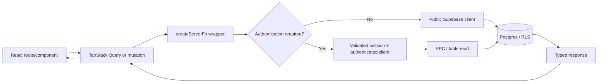
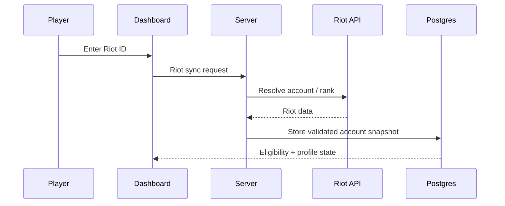
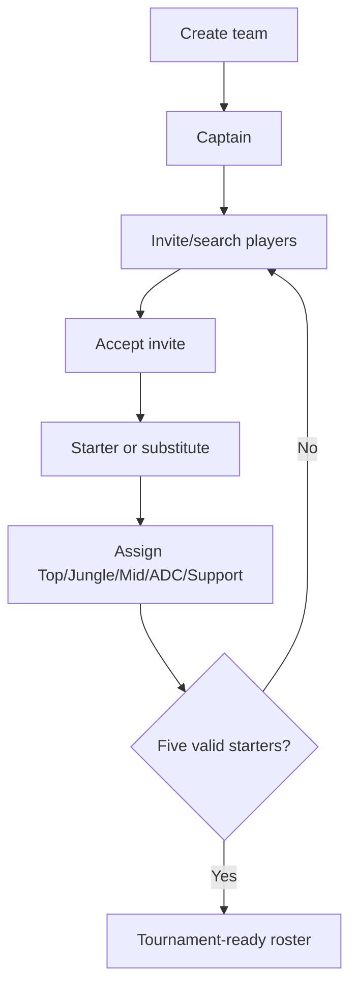
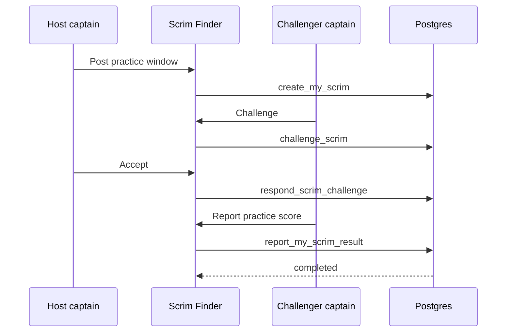
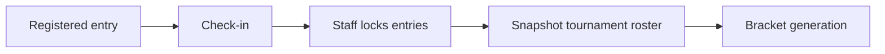
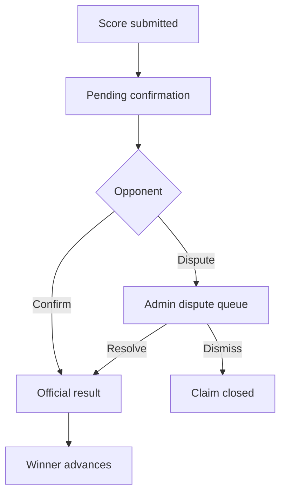
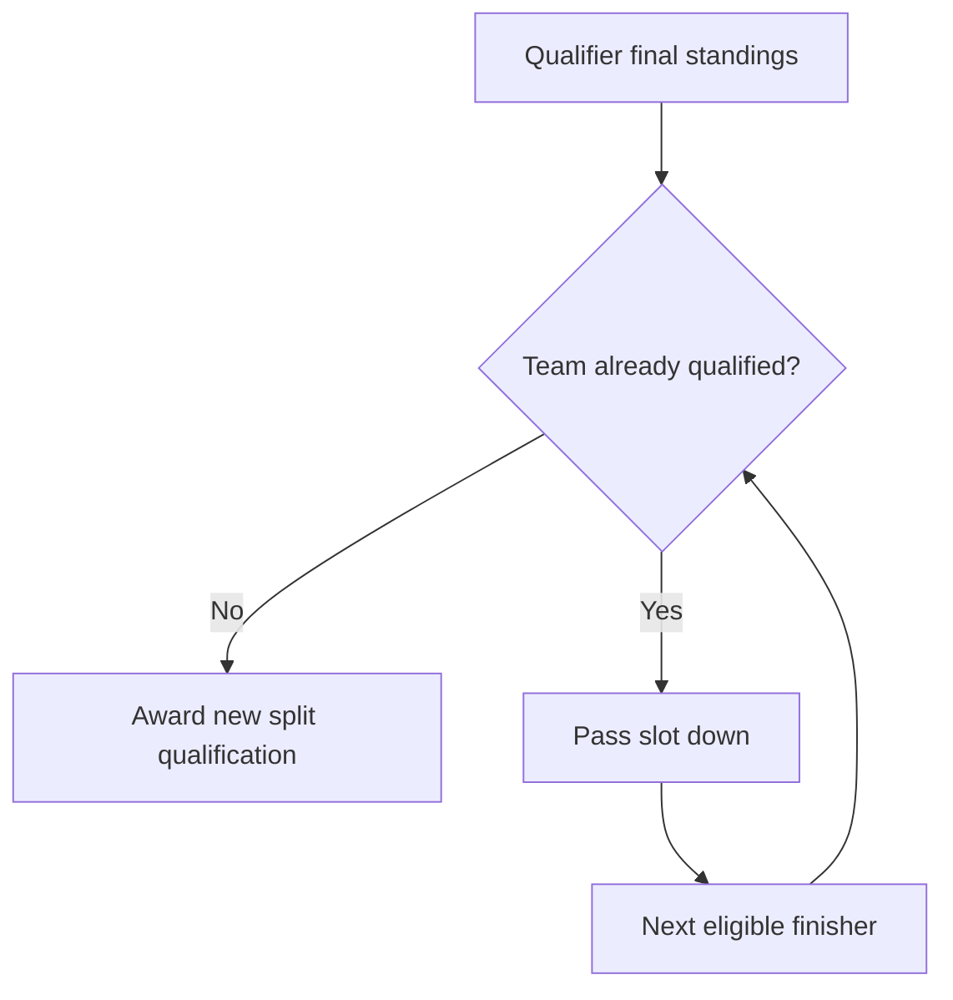
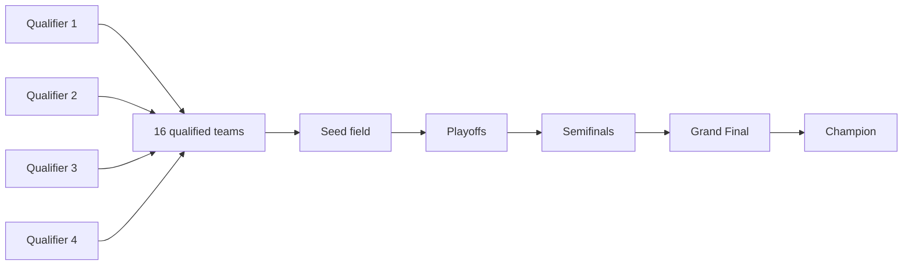

# EloShape end-to-end flow reference

Last reviewed: 2026-09-22. Reference branch: `staging`.

This document connects the product UI to the exact application layer, database boundary and regression coverage. Use it when answering “what code runs when I do X?”

## 1. Request architecture

The browser never receives the Supabase service-role key. Competitive writes are validated again in Postgres.

## 2. Player onboarding and Riot account

| Layer | Implementation |
| --- | --- |
| Main UI | `src/routes/_authenticated/dashboard.tsx` |
| Profile UI | `ProfileSettingsCard.tsx`, `OnboardingChecklist.tsx` |
| Riot UI | `RiotAccountCard.tsx` |
| Server wrappers | `profile.functions.ts`, `riot.functions.ts`, `me.functions.ts` |
| Server implementation | `profile.server.ts`, `riot.server.ts`, `riot-account.server.ts`, `me.server.ts` |
| Primary tables | `profiles`, `riot_accounts`, `legal_acceptances`, `eligibility_reviews` |
| Important invariant | Riot rank determines eligibility/division; it does not award EloShape points. |

## 3. Team creation and roster management

| Action | UI | Server boundary | Main database entities |
| --- | --- | --- | --- |
| Create team | `/team` | `team.functions.ts` | `teams`, `team_members` |
| Invite player | `/team` / `/team/players` | `team.functions.ts` | `team_invites` |
| Accept/decline invite | `/team` | `team.functions.ts` | `team_invites`, `team_members` |
| Starter/substitute | `/team` | `team-management.functions.ts` | `team_members.role` |
| Lane assignment | `/team` | `team-management.functions.ts` | `team_members.lane_role` |
| Captain transfer | `/team` | `team-management.functions.ts` | `teams.captain_id`, `team_members` |
| Team identity | `/team/settings` | team management RPCs | `teams` |
| Public roster | `/teams/$slug` | `eloshape.server.ts` | `teams`, `team_members`, tournament history |

## 4. Team directory

Route: `src/routes/teams.index.tsx`.

Data source:
- `teamsQuery()`
- `getTeams()`
- `loadTeams()`
- `teams` table with division/city relations.

The directory is official competition data only. Search/filter/sort are client-side because the current field is small.

`TeamCard.tsx` is entirely clickable. Season points, official record and titles come from official tournament accounting; scrims never contribute.

## 5. Scrim Finder

Route surface: `/teams` → Scrim Finder.

Main UI: `src/components/eloshape/ScrimBoard.tsx`.

Server boundary: `src/lib/scrim.functions.ts`.

Database:
- `scrim_posts`
- `scrim_challenges`

RPC lifecycle:
- `list_scrims`
- `get_my_scrim_hub`
- `create_my_scrim`
- `challenge_scrim`
- `respond_scrim_challenge`
- `cancel_my_scrim`
- `report_my_scrim_result`

Critical invariant: this flow must not write `ranking_points`, `team_ranking_points`, `split_qualifications` or official `matches`.

Regression coverage: `supabase/tests/scrims_and_priority.test.sql`.

## 6. Tournament registration

Public route: `/tournaments/$slug`.

Registration component: `TournamentRegisterButton.tsx`.

Server files:
- `tournament.functions.ts`
- `tournament-entry.server.ts`

Database entities:
- `tournaments`
- `tournament_entries`
- `team_members`
- `riot_accounts`
- `profiles`

Registration validates:
1. tournament status;
2. remaining capacity;
3. correct mode;
4. division;
5. geography;
6. roster size;
7. starter eligibility;
8. Riot platform/rank/account-level requirements;
9. qualifier priority gate when applicable.

A successful registration is still not a locked competition roster.

## 7. Check-in, entry lock and immutable roster

Staff competition code: `competition.server.ts`.

RPC: `staff_lock_tournament_entries`.

Locking creates `tournament_roster_members` snapshots. This is intentional: if a Team HQ roster changes afterwards, the tournament still uses the lineup that was locked for that event.

## 8. Bracket generation

Application:
- `src/lib/bracket.ts` builds seeds/topology.
- `competition.server.ts::generateTournamentBracket` sends the topology to the database.
- `staff_create_bracket` persists it.

Storage:
- `matches.round_index`
- `matches.bracket_slot`
- `entry_a_id`
- `entry_b_id`
- `winner_entry_id`

For a standard 16-team single-elimination field:

| Round | Matches |
| --- | ---: |
| Round of 16 | 8 |
| Quarterfinals | 4 |
| Semifinals | 2 |
| Final | 1 |
| Total | 15 |

## 9. Public bracket rendering

Component: `src/components/eloshape/BracketView.tsx`.

The visual geometry is deliberately independent of text height:
- fixed card height;
- explicit vertical gap/pitch;
- board height based on the largest round;
- round centers derived from the reserved board height;
- SVG connectors drawn between match centers.

Do not replace fixed card geometry with content-driven heights unless connector geometry is changed at the same time.

Regression inspection must include:
- pending Round of 16;
- completed Round of 16;
- 8/4/2/1 progression;
- bye;
- walkover;
- long team names;
- desktop;
- mobile horizontal scroll.

## 10. Result reporting

Participant flow:
- `/matches/$matchId`
- `match-result.functions.ts`
- `match_result_claims`

Staff direct path:
- `competition.functions.ts`
- `competition.server.ts`
- staff RPCs.

Completed-result correction is allowed only before downstream competition makes the correction unsafe.

## 11. Bye and walkover

| Type | Advances | Match-win points | Notes |
| --- | ---: | ---: | --- |
| Played win | Yes | Yes | Normal result |
| Walkover | Yes | Yes | Audited reason required |
| Bye | Yes | No | No opponent was beaten |

Use `resolution_type` for scoring semantics.

## 12. Tournament finalization

RPC: `staff_finalize_tournament`.

Finalization:
1. verifies bracket completion;
2. derives match wins;
3. derives placements;
4. applies `point_rules`;
5. writes ranking ledger events;
6. updates entry placement/points;
7. recomputes cached totals;
8. awards qualifier slots when relevant;
9. marks tournament complete;
10. writes audit history.

Ledger writes use idempotent event keys.

## 13. Qualifiers: standings versus qualification outcome

These are intentionally separate concepts.

**Final standings** answer: “where did each team finish in this tournament?”

**Qualification outcome** answers: “which teams gained new Semi-Split playoff slots from this tournament?”

An already-qualified team can finish first again in a later qualifier after its protected registration window opens. That does not consume another playoff slot. The slot passes down to the next eligible team.

Public tournament detail now exposes the qualification outcome separately from final standings and labels already-qualified teams so repeated standings cannot be mistaken for duplicated tournament data.

The source of truth is `split_qualifications`.

## 14. Qualifier priority window

Column: `tournaments.qualified_teams_registration_opens_at`.

Before that timestamp, already-qualified teams are blocked from re-entering that qualifier so non-qualified teams receive first access to the limited field.

After the gate opens, qualified teams may register if capacity remains.

This rule and the scrim lifecycle are jointly regression-tested in `scrims_and_priority.test.sql`.

## 15. Semi-Split

Public:
- `/splits`
- `/splits/$slug`
- `splits.functions.ts`
- `splits.server.ts`
- `split-queries.ts`

Staff:
- `/admin/splits`
- `split-ops.functions.ts`

Tables:
- `competitive_splits`
- `split_qualifications`
- qualifier `tournaments`
- playoff tournament/matches.

## 16. Rankings and points

Player ranking source: `ranking_points`.

Team ranking source: `team_ranking_points`.

Cached totals on `profiles` and `teams` are derived convenience values, not the authoritative award history.

Public ranking route: `/rankings`.

Scoring configuration: `point_rules`.

## 17. Eligibility review

Admin surface: `/admin`.

Read model: `admin.server.ts`.

Primary entities:
- `profiles.eligibility`
- `eligibility_reviews`
- `user_roles`

The active review queue is separate from decision history.

## 18. Support and disputes

Support:
- user route `/support`;
- admin route `/admin/support`;
- `support.functions.ts`;
- `support_requests`.

Match disputes:
- `/admin/disputes`;
- `match_result_claims`;
- audited staff resolution RPCs.

## 19. CI regression chain

GitHub workflow: `.github/workflows/ci.yml`.

The required chain includes:
- dependency install;
- lint;
- production build;
- generated route-tree cleanliness;
- TypeScript;
- Vitest unit tests;
- Supabase security boundary tests;
- competition-engine integration tests;
- 16-team Semi-Split stress test;
- scrim + qualifier-priority regression test.

A visual feature is not considered complete simply because TypeScript compiles. Bracket and responsive UI still require visual QA.

## 20. Where to look next

- database fields: `SCHEMA_REFERENCE.md`
- every RPC/function signature: `RPC_REFERENCE.md`
- entity relationships: `DATABASE.md`
- code/file ownership: `CODE_MAP.md`
- tournament rules: `COMPETITION_ENGINE.md`
- team/scrim rules: `TEAMS_AND_SCRIMS.md`
- environment/deployment: `ENVIRONMENTS.md`
- staff procedures: `OPERATIONS.md`
