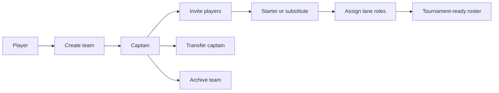
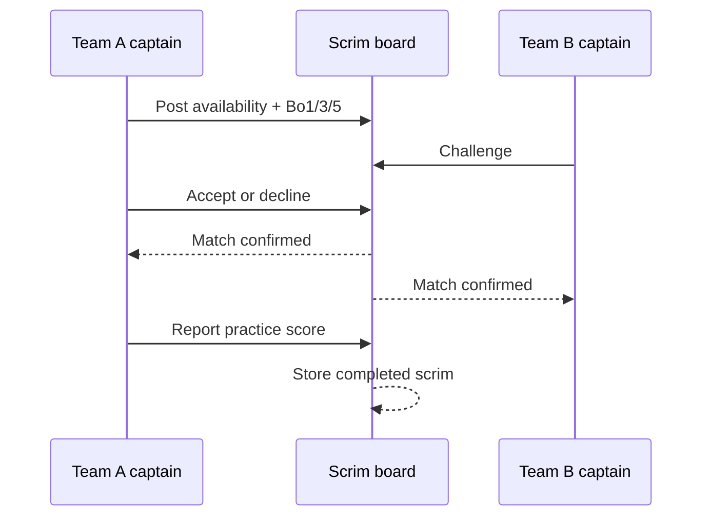

# Teams and Scrims

## 1. Team lifecycle

Team self-service is implemented through authenticated RPCs. Browser code does not directly mutate the competitive tables.

## 2. Team roles

Roster membership distinguishes:
- starter/player;
- substitute;
- captain authority.

Starting-five lane roles are:
- Top
- Jungle
- Mid
- ADC/Bot
- Support

The Team HQ surfaces roster readiness and captain-only actions.

## 3. Invitations

Captain:
1. searches candidates or invites by handle;
2. chooses starter/substitute;
3. invite is persisted;
4. player accepts or declines;
5. accepted player becomes a member.

Pending invites are separate from active members.

## 4. Captain transfer

Captain authority can be transferred to an eligible team member. The server/database path validates membership and prevents client-side role escalation.

## 5. Team archival

Archival is preferred over unsafe destructive deletion. It preserves historical tournament references and prevents old competition records from breaking.

## 6. Public Team Directory

`/teams` contains two product views:

- Team directory — official team records/points.
- Scrim Finder — practice only.

The directory:
- searches name/tag/city;
- filters by division;
- sorts by season points, win rate, titles or name;
- links the entire team card to the public roster profile.

Official team metrics do not include scrim results.

## 7. Scrim Finder

Scrim flow:

## 8. Scrim permissions

- anyone can browse the public practice board;
- only authenticated team captains can post;
- only captains can challenge;
- host captain accepts/declines challenges;
- participating captains can save the practice result.

## 9. Scrim states

`scrim_posts`:
- open
- matched
- cancelled
- completed

`scrim_challenges`:
- pending
- accepted
- declined
- cancelled

## 10. Scrim invariants

Scrims are completely outside official competition accounting.

A scrim must never:
- award `ranking_points`;
- award `team_ranking_points`;
- alter `split_qualifications`;
- alter official tournament entries/matches;
- affect Semi-Split seeding.

The regression test snapshots team ranking ledger count before a complete scrim lifecycle and asserts it is unchanged afterwards.

## 11. Scheduling validation

Current server rules include:
- start must be at least 10 minutes in the future;
- end, if provided, must be after start;
- format is Bo1/Bo3/Bo5;
- note length is limited;
- a team cannot challenge itself;
- closed/started scrims cannot be challenged.

## 12. Product intent

Scrims solve a specific problem: once a team has qualified or simply wants structured practice, it should have a way to find opponents without manipulating official qualifiers just to get games.
